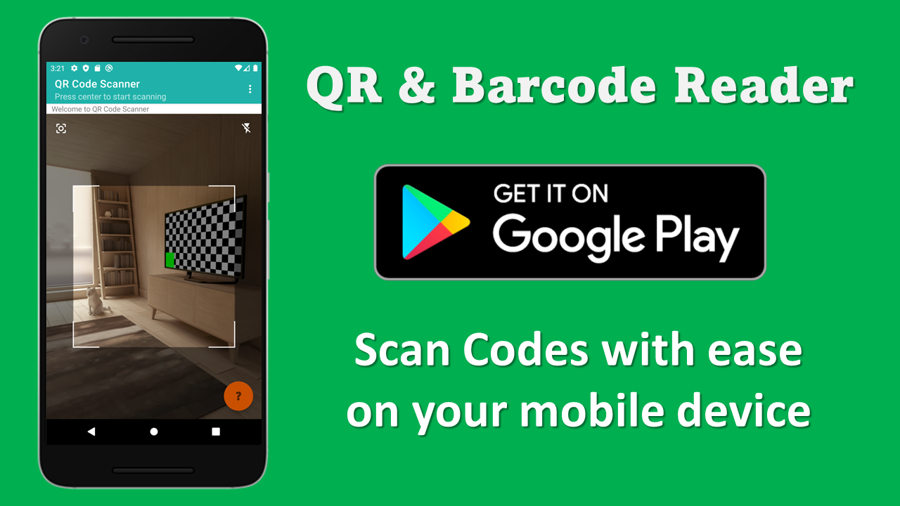

# QRCode Android App

A simple QR Code and Bar Code scanner built with kotlin.

## Features

* Scan QR code and Bar code to clipboard
* View last scanned code
* Automatic QR Code detection
* Flash light for Camera
* Connect to QRCode server for a more connected experience

## Advanced Features

Download the QR Code server to do much more with your app. 
Connect with other applications or write to file etc.